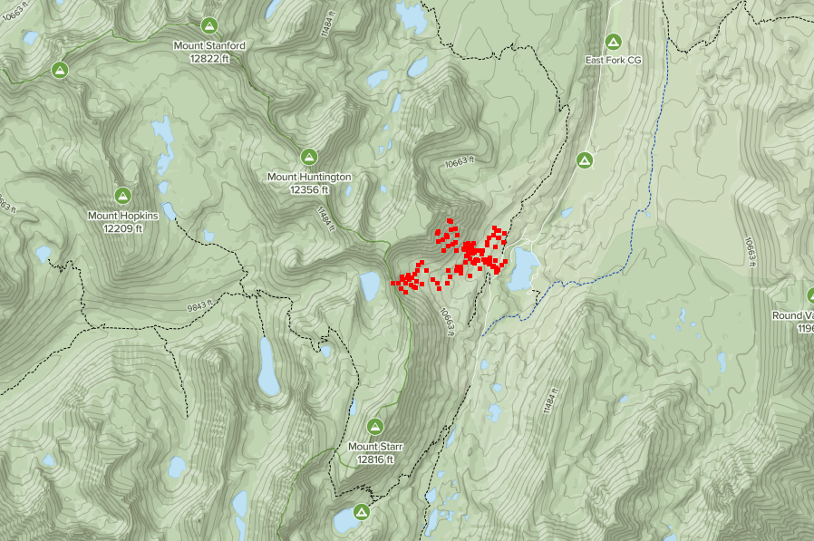

# AnyHike

Example project for ZIO-gRPC

Imagine there is a hiker reporting his location to a service as he is walking.
Later he can download the recorded hike. In addition, fans can live stream his location.



There are four subprojects:

- **protos**: the protocol buffer and the RPC service definition. The other
  projects depend on this project.
- **server**: contains 4 implementations of the service. The last one
  (HikeService4.scala) is the most complete.
- **client**: an example client of this service
- **webapp**: a Scala.js webapp that exercises this server.

You may want to install [grpcurl](https://github.com/fullstorydev/grpcurl) to experiment with the server from the
command line.

# Running the server

In one terminal, start the server inside `sbt`:

```
server/runMain anyhike.server.Main4
```

Now that the server is running, you can connect to it from the command line
tool. We will use grpcurl to find out what services are available:

```
$ grpcurl -plaintext localhost:9000 list
anyhike.HikeStore
grpc.reflection.v1alpha.ServerReflection
```

We see that `anyhike.HikeStore` is available. Let's see what methods it
provides:

```
$ grpcurl -plaintext localhost:9000 list anyhike.HikeStore
anyhike.HikeStore.AddLocations
anyhike.HikeStore.GetLocations
anyhike.HikeStore.StreamLocations
```

We have the `AddLocations` method that records new location, `GetLocations`
that retrieves the recorded locations, and `StreamLocations` that streams
newly added locations.

Let's invoke the AddLocations method:

```
grpcurl -d '{"locations": [{"lat": 37.12, "lng": 35.42, "timestamp": 10451}]}' \
-plaintext localhost:9000 anyhike.HikeStore/AddLocations
```

and we can retrieve that:
```
$ grpcurl -plaintext localhost:9000 anyhike.HikeStore/GetLocations
{
  "locations": [
    {
      "lat": 37.12,
      "lng": 35.42,
      "timestamp": "10451"
    }
  ]
}
```

Try connecting to `StreamLocations` from one terminal, and calling `AddLocations` from another.

# Connecting from Scala client
You can also try to invoke the Scala client from sbt:
```
client/run
```

# Setting up the web application

To run the demo locally, you need to install:

* Docker and docker-compose
* npm

Build the webapp, in SBT:
```
webapp/fastOptJS::webpack
```

In order to serve it, we are setting up a container an nginx server to server the static files.
In front of it, we will put together envoyproxy server that would route the grpc-web requests
coming from the browser into our gRPC server running on the host.

```
                         +--> nginx (for static files, including the compiled JS code)
Browser --> envoyproxy --+
                         +--> our grpc server
```

To create this setup on OS X and Windows:

    docker-compose up

To create this setup on Linux:

    docker-compose -f docker-compose.yml -f docker-compose.linux.yml up

Now, while you still have the server running on port 9000 as usual, point your browser to
http://localhost:8080 and interact with the map.

Try openning the url in another window and watch what happens when you interact.

Try to stop the server, and instead run HikeService3 which does a random walk:
server/runMain anyhike.server.Main3

and visualize it using the app.
